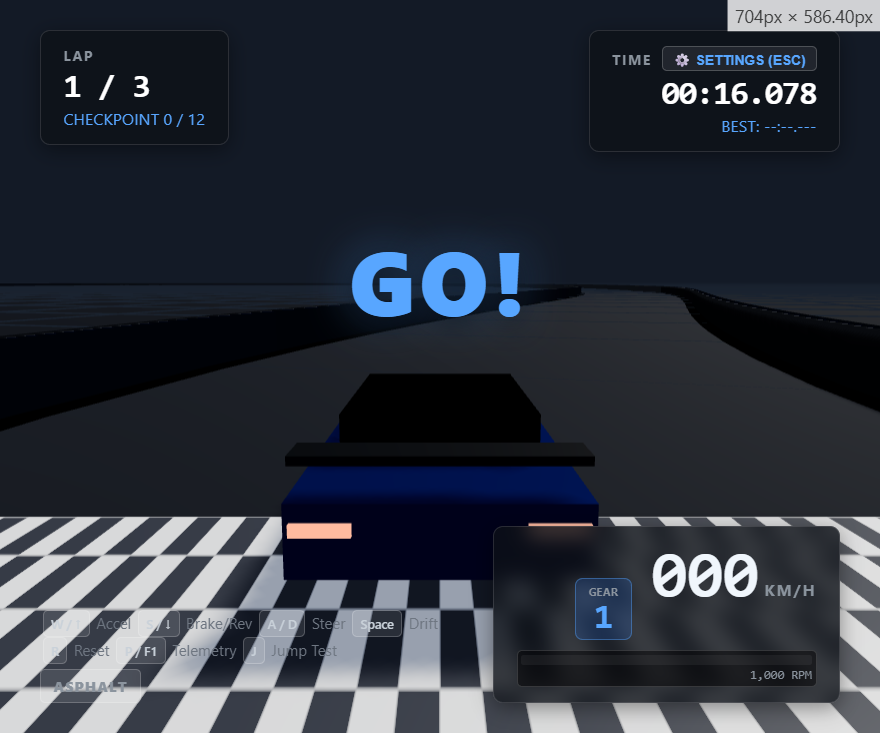

# 🏎️ Apex Racer — 3D Browser Racing Engine

A high-performance, production-quality browser-based 3D racing game built from scratch with **Three.js**, **TypeScript**, and **Vite**.



---

## 🌟 Highlights & Features

* **Physics & Drivetrain (`Drivetrain.ts`)**:
  * Simulated engine RPM (1,000–8,200 RPM) with powerband torque curves and rev limiter dropoff.
  * 6-speed automatic transmission with realistic gear-speed thresholds and clutch slip during launches.
  * Smooth automatic downshifts and reverse gear engagement.
* **Speed-Sensitive Steering (`SteeringSystem.ts`)**:
  * Input deadzone, cubic response curve, and progressive high-speed authority tapering (0–160+ km/h).
  * Counter-steer drift assist (`OFF`, `LOW`, `MEDIUM`, `HIGH`).
* **4-Wheel Suspension & Weight Transfer (`SuspensionSystem.ts`)**:
  * Independent spring-damper nodes (FL, FR, RL, RR) with longitudinal pitch (dive/squat) and lateral body roll.
  * High-frequency rumble when riding kerbs.
* **Tire Friction & Drift Dynamics (`TireSystem.ts`)**:
  * 4-wheel friction circle and slip angle calculation.
  * Handbrake (`Space`) rear traction break for controllable drifting.
* **Surface Classification (`SurfaceSystem.ts`)**:
  * Dynamic surface properties for `ASPHALT`, `KERB`, and `GRASS` with custom grip and rolling resistance.
* **Dynamic Follow Camera (`CameraManager.ts`)**:
  * Acceleration setback, braking push, speed-adaptive FOV ($60^\circ \to 78^\circ$), curb rumble, and ground collision prevention.
* **Modern Telemetry HUD & Settings Modal**:
  * Digital KM/H speedometer, gear badge, RPM bar with redline, surface indicator, and lap/checkpoint tracking.
  * In-game settings modal (`ESC` or button) for sensitivity, return speed, assist, and vehicle chassis presets (`Sports`, `Supercar`, `Rally`, `Formula`).
* **Zero-Allocation Architecture**:
  * Pre-allocated scratch vectors and matrices running at a steady **100 FPS** with only **22 draw calls**.

---

## 🎮 Controls

| Action | Primary Key | Secondary Key |
| :--- | :--- | :--- |
| **Accelerate** | `W` | `↑` (Up Arrow) |
| **Brake / Reverse** | `S` | `↓` (Down Arrow) |
| **Steer Left / Right** | `A` / `D` | `←` / `→` (Arrows) |
| **Handbrake / Drift** | `Space` | — |
| **Reset to Checkpoint** | `R` | — |
| **Open Settings Modal** | `Escape` / `O` | Click `⚙️ SETTINGS` button |
| **Toggle Performance Telemetry** | `P` / `F1` / `~` | Click `P / F1` badge |
| **Jump Test (Developer)** | `J` | — |

---

## 🛠️ Getting Started

### Prerequisites
* Node.js (v18+)
* npm (v9+)

### Installation
```bash
npm install
```

### Run Locally (Dev Server)
```bash
npm run dev
```
Open `http://localhost:3000` in your browser.

### Production Build
```bash
npm run build
npm run preview
```

---

## 🏛️ Project Structure

```text
src/
├── assets/          # Asset caching and lifecycle management
├── config/          # Central GameConfig and presets
├── core/            # Game coordinator, GameState, GameLoop, Time
├── input/           # InputManager decoupling key states
├── performance/     # 60fps/100fps performance & telemetry overlay
├── physics/         # VehiclePhysics, PhysicsWorld, SurfaceSystem
├── rendering/       # Three.js WebGL Renderer, SceneManager, CameraManager
├── tracks/          # CatmullRom procedural spline track, barriers, kerbs, checkpoints
├── ui/              # HUD tachometer cluster, SettingsModal
└── vehicles/        # Drivetrain, SteeringSystem, SuspensionSystem, TireSystem, Vehicle
```

---

## 📄 License
MIT License.
